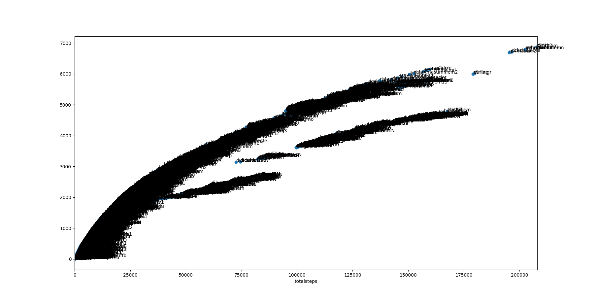
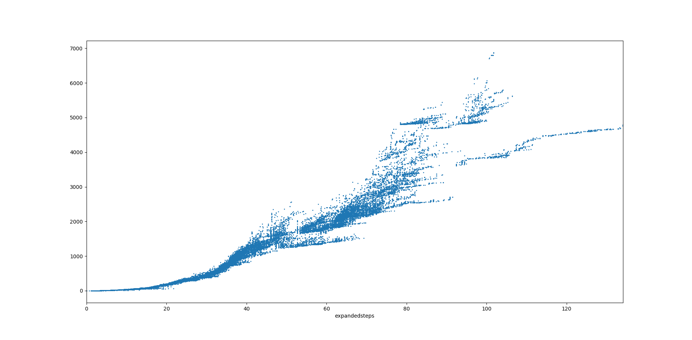

# MMplot

Plots Metamath theorem statistics

Examples:

Number of proof steps vs number of subtheorems:

Number of total (deduplicated) proof steps vs number of subtheorems:

Number of the log of expanded (including duplicate) proof steps vs number of subtheorems:

## Install

`pip install -r requirements.txt`

## Plot
`python plotit.py`

## Update data

This is only necessary to update the data which is included in this repository!

Collect all proof labels

`python print_prooflabels_mmverify.py > prooflabels.txt`

This next step may take > 1 hours

`python thmstats.py > thmsteps.csv`

Or, to append to existing file:

`python thmstats.py >> thmsteps.csv`
