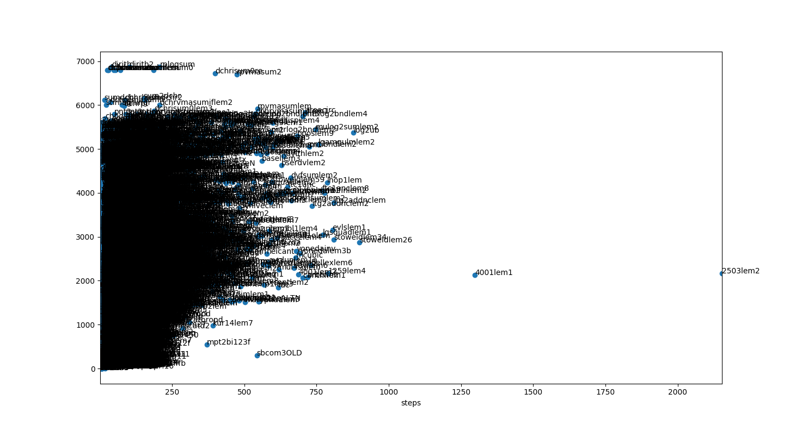

# MMplot

Plots Metamath theorem statistics

Example: number of proof steps vs number of subtheorems:

## Run

Collect all proof labels

`python print_prooflabels_mmverify.py > prooflabels.txt`

This next step may take > 1 hours

`python thmstats.py > thmsteps.csv`

Or, to append to existing file:

`python thmstats.py >> thmsteps.csv`

## Plot
`python plotit.py`
