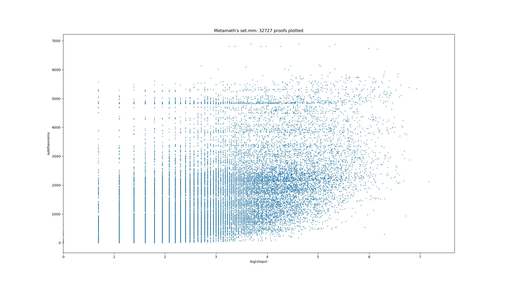
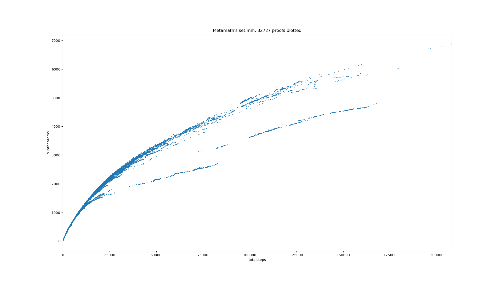

# MMplot

Plots Metamath theorem statistics

Examples:

Number of proof steps vs number of subtheorems:



Number of total (deduplicated) proof steps vs number of subtheorems:



Number of the log of expanded (including duplicate) proof steps vs number of subtheorems:


Maximum path length (proof depth) vs number of subtheorems


Proof depth vs expanded steps


## Install

`pip install -r requirements.txt`

## Plot
`python plotit.py`

## Update data

This is only necessary to update the data which is included in this repository!

This step may take > 1 hour

```
cd metamath && gcc m*.c -O3 -o metamath && ./metamath set.mm > out2.csv
show trace_back * /essential /count_steps
exit
```
Can't tell when it exits this way, maybe `tee` it.
TODO new format
